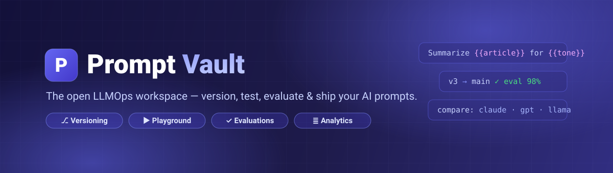
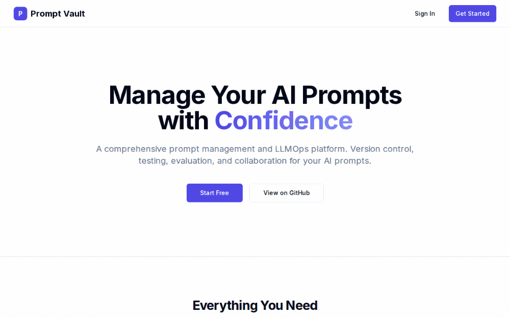
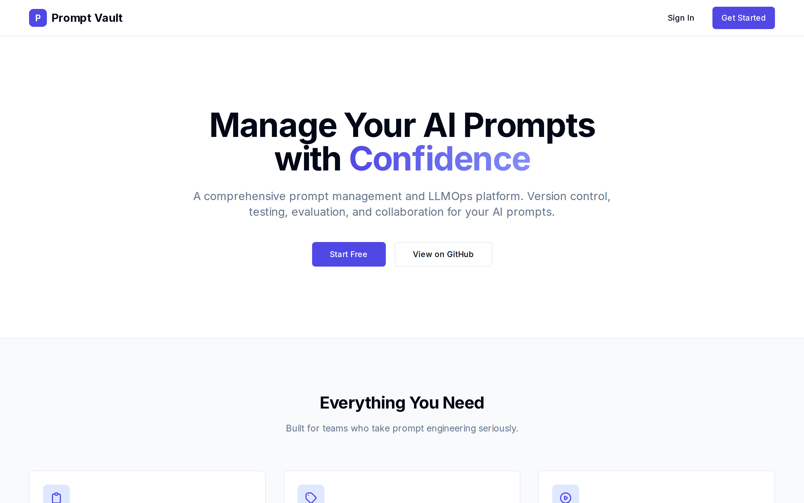
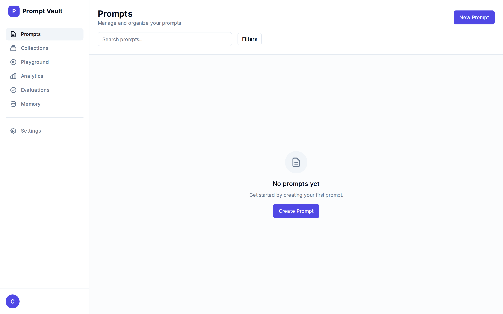
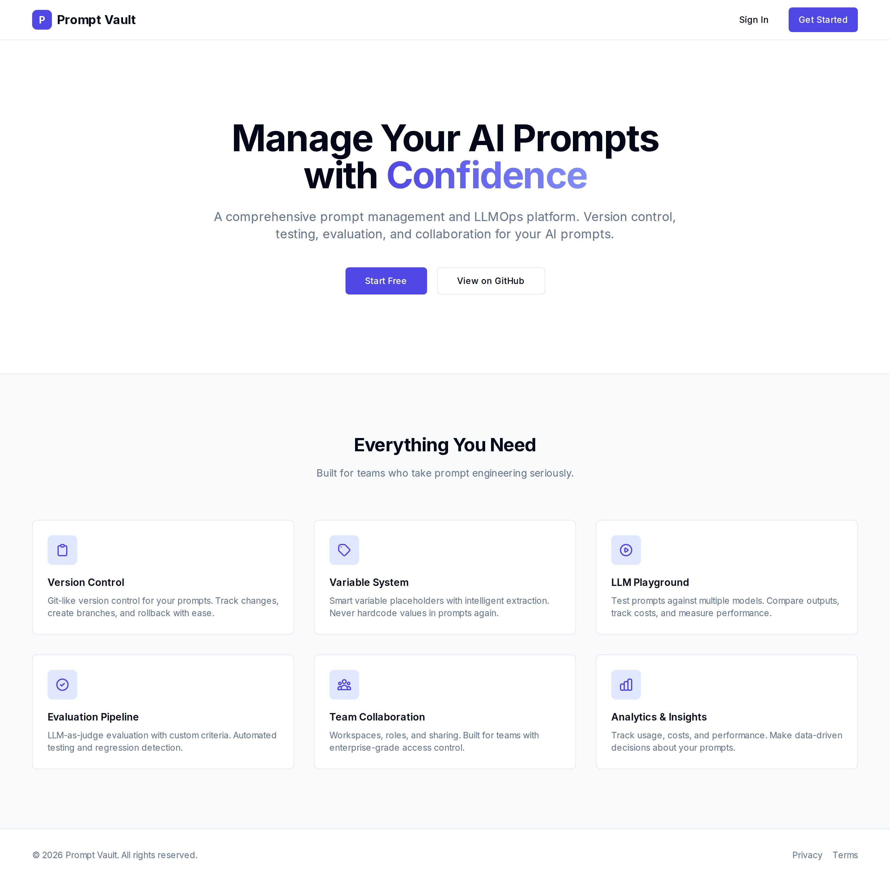
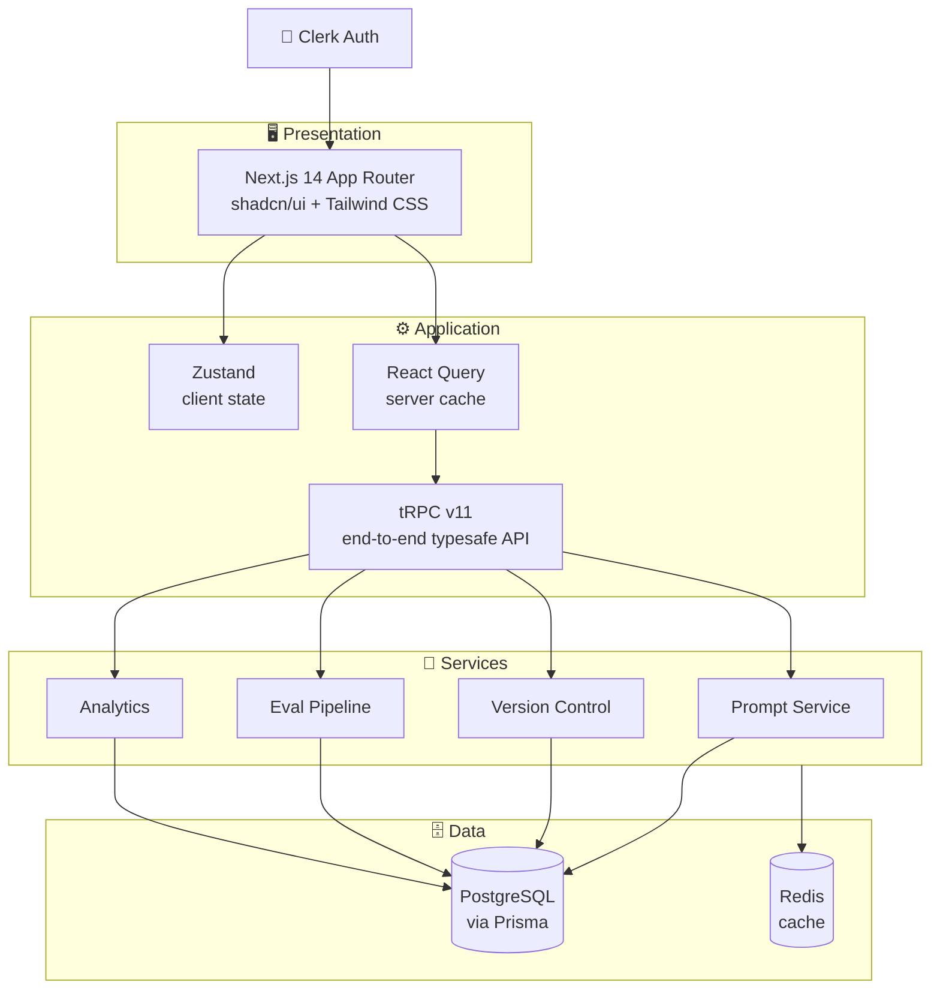

<div align="center">



<br/>

**Version control, testing, evaluation, and collaboration for your AI prompts — in one place.**

[](https://nextjs.org)
[](https://www.typescriptlang.org)
[](https://tailwindcss.com)
[](https://trpc.io)
[](https://www.prisma.io)
[](https://www.postgresql.org)

[Features](#-features) · [Screenshots](#-see-it-in-action) · [Architecture](#-architecture) · [Quick Start](#-quick-start) · [Roadmap](#-roadmap)

<br/>



</div>

---

## 💡 What is Prompt Vault?

Prompt Vault is a **prompt management & LLMOps platform** for teams that take prompt engineering seriously. Instead of scattering prompts across docs, chats, and code, Prompt Vault gives you a single workspace to **write, version, test, evaluate, and share** them — with the same rigor you'd apply to production code.

Think *"Git + CI + analytics dashboard"*, but purpose-built for prompts.

## ✨ Features

| | Feature | What it does |
|---|---|---|
| 🗂️ | **Version Control** | Git-like history for every prompt — track changes, branch, and roll back with ease |
| 🏷️ | **Variable System** | Smart `{{placeholders}}` with intelligent extraction, so values are never hardcoded |
| 🎮 | **LLM Playground** | Run prompts against multiple models side by side; compare outputs, latency, and cost |
| ✅ | **Evaluation Pipeline** | LLM-as-judge scoring with custom criteria, automated testing, and regression detection |
| 👥 | **Team Collaboration** | Workspaces, roles, and sharing with enterprise-grade access control |
| 📊 | **Analytics & Insights** | Usage, cost, and performance tracking to drive data-informed prompt decisions |
| 🧠 | **Agent Memory** | Manage long-lived memory for agents alongside the prompts that use it |

## 📸 See It in Action

### The landing page



### The dashboard

A focused workspace with quick navigation to Prompts, Collections, Playground, Analytics, Evaluations, and Memory:



<details>
<summary><b>🖼️ Full landing page (click to expand)</b></summary>
<br/>

</details>

## 🏗 Architecture



## 🛠 Tech Stack

| Layer | Technology |
|---|---|
| Framework | [Next.js 14](https://nextjs.org) (App Router) + [React 18](https://react.dev) |
| Language | [TypeScript](https://www.typescriptlang.org) (strict) |
| Styling | [Tailwind CSS](https://tailwindcss.com) + [shadcn/ui](https://ui.shadcn.com) |
| API | [tRPC v11](https://trpc.io) + [Zod](https://zod.dev) + [superjson](https://github.com/blitz-js/superjson) |
| Database | [PostgreSQL](https://www.postgresql.org) + [Prisma](https://www.prisma.io) |
| State | [Zustand](https://zustand-demo.pmnd.rs) + [TanStack Query](https://tanstack.com/query) |
| Auth | [Clerk](https://clerk.com) |
| Tooling | ESLint · Prettier · Husky · commitlint |

## 🚀 Quick Start

> **Prerequisites:** Node.js 18+, Docker & Docker Compose, and a free [Clerk](https://clerk.com) account.

```bash
# 1. Clone the repository
git clone https://github.com/christireid/clarity-vault.git
cd clarity-vault

# 2. Install dependencies
npm install

# 3. Configure environment variables
cp .env.example .env.local   # then add your Clerk keys

# 4. Start Postgres & Redis
docker-compose up -d

# 5. Push the database schema
npm run db:push

# 6. Run the dev server 🎉
npm run dev
```

Open [http://localhost:3000](http://localhost:3000) and you're in.

### Useful scripts

| Command | Description |
|---|---|
| `npm run dev` | Start the development server |
| `npm run build` | Production build |
| `npm run lint` / `lint:fix` | Lint (and auto-fix) |
| `npm run typecheck` | TypeScript type checking |
| `npm run format` | Format with Prettier |
| `npm run db:push` | Push Prisma schema to the database |
| `npm run db:studio` | Open Prisma Studio |
| `npm run db:seed` | Seed the database |

## 📁 Project Structure

```
clarity-vault/
├── app/                 # Next.js App Router
│   ├── (auth)/          #   Sign-in / sign-up (Clerk)
│   ├── (dashboard)/     #   Authenticated workspace
│   └── api/trpc/        #   tRPC HTTP handler
├── components/ui/       # shadcn/ui components
├── server/              # tRPC routers & DB client
├── lib/                 # Utils, validations, tRPC clients
├── hooks/               # Custom React hooks
├── store/               # Zustand stores
├── types/               # Shared TypeScript types
├── prisma/              # Schema (13 models), seed, init SQL
└── docs/                # Implementation strategy & phase plans
```

## 🗺 Roadmap

Prompt Vault is being built in phases — the [full implementation strategy](./docs/IMPLEMENTATION_STRATEGY.md) covers 15 of them:

- [x] **Phase 1 — Foundation & Core Infrastructure** · Next.js scaffold, auth, database schema, tRPC, design system
- [ ] **Phase 2 — Core Prompt CRUD & UI** · prompt editor, cards, search & filters
- [ ] **Phase 3 — Version Control System** · git-like history, diffing, rollback
- [ ] **Phase 4–5 — Context, Attachments & Collections**
- [ ] **Phase 6 — LLM Integration & Playground** · multi-model testing
- [ ] **Phase 7 — RAG & Vector Search**
- [ ] **Phase 8 — Evaluation & Testing** · LLM-as-judge pipelines
- [ ] **Phase 9 — Analytics & Observability**
- [ ] **Phase 10–11 — Memory Management & Team Collaboration**
- [ ] **Phase 12–15 — API & Integrations, Billing, Security, Production**

📚 Dive deeper: [Implementation Strategy](./docs/IMPLEMENTATION_STRATEGY.md) · [Phase 1 Project Plan](./docs/PHASE_1_PROJECT_PLAN.md)

## 🤝 Contributing

Contributions are welcome! This project uses [conventional commits](https://www.conventionalcommits.org) (enforced via commitlint + Husky). Fork, branch, and open a PR.

## 📄 License

Released under the MIT License.

---

<div align="center">
  <sub>Built with ❤️ and a healthy obsession with well-managed prompts.</sub>
</div>
